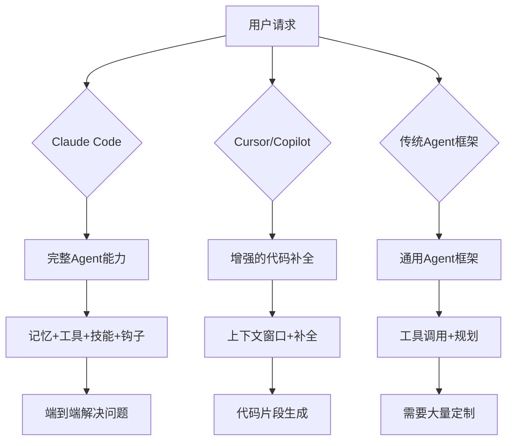

# Claude Code架构设计哲学：为什么它是Agent时代的操作系统

## 引言：重新定义Agentic Coding

在AI编程助手领域，我们见证了从**代码补全**（Copilot）到**上下文理解**（Cursor）再到**代码生成**（各种IDE插件）的演进。但Claude Code代表了一种全新的范式：**Agentic Coding**。

这不是简单的技术迭代，而是**根本性的架构范式转变**。

> **核心观点**：Claude Code不是在做"更好的代码补全"，而是在构建"Agent时代的操作系统"。

## 第一部分：从工具到操作系统的范式转变

### 传统IDE助手的局限

让我们先看看传统方案的根本问题：

```python
# 传统代码补全的工作方式
def traditional_code_completion(context_window):
    # 1. 截取当前光标前后的代码片段
    context = get_surrounding_code(cursor_position, window_size=2000)
    
    # 2. 发送到模型
    suggestion = model.predict(context)
    
    # 3. 返回补全建议
    return suggestion

# 问题：没有状态，没有记忆，没有工具调用能力
# 就像一个只会说"下一句话应该是什么"的鹦鹉
```

**根本局限**：
- **无状态**：每次调用都是独立的，没有跨会话记忆
- **无工具**：只能生成文本，无法执行实际操作
- **无上下文**：不理解项目结构、依赖关系、测试结果
- **无人格**：没有持续的"自我"概念

### Claude Code的Agent架构

Claude Code采用了完全不同的架构思路：

```python
# Claude Code的Agent工作方式
class ClaudeCodeAgent:
    def __init__(self):
        self.memory = PersistentMemory()  # 持久化记忆
        self.tools = ToolRegistry()       # 工具注册表
        self.hooks = HookSystem()         # 钩子系统
        self.skills = SkillManager()      # 技能管理器
        
    def execute_task(self, user_request):
        # 1. 理解请求，调用相关记忆
        context = self.memory.recall_relevant(user_request)
        
        # 2. 规划任务，选择工具
        plan = self.plan_task(user_request, context)
        
        # 3. 执行，过程中可以调用任意工具
        result = self.execute_with_tools(plan)
        
        # 4. 学习，更新记忆
        self.memory.update(result, user_request)
        
        return result
```

**核心差异**：

| 维度 | 传统工具 | Claude Code |
|------|----------|-------------|
| 状态 | 无状态 | 有状态，有记忆 |
| 能力 | 文本生成 | 工具调用+执行 |
| 上下文 | 单文件片段 | 整个项目+历史 |
| 交互 | 被动响应 | 主动规划执行 |
| 学习 | 无 | 持续学习优化 |

## 第二部分：Claude Code的三层架构

Claude Code的架构可以分为三个核心层次：

### 第1层：感知层（Perception Layer）

**职责**：理解用户意图和环境状态

```yaml
感知组件:
  - 代码理解器: 分析代码结构、依赖关系、测试结果
  - 上下文构建器: 整合项目信息、历史会话、用户偏好
  - 意图解析器: 从自然语言到可执行任务
  
感知能力:
  - 全项目理解: 不只看当前文件，理解整个代码库
  - 多模态输入: 支持代码、文本、图片、错误日志
  - 历史整合: 结合过去的会话和决策
```

**实际案例**：当你要求"修复这个bug"时，Claude Code会：
1. 分析错误日志（感知问题）
2. 搜索相关代码（感知上下文）
3. 查看历史修复记录（感知经验）
4. 理解你的意图（是要快速修复还是根因分析？）

### 第2层：推理层（Reasoning Layer）

**职责**：规划任务、决策、学习

```python
class ReasoningEngine:
    def plan_task(self, request, context):
        """
        任务规划：将复杂请求分解为可执行步骤
        """
        # 1. 分析任务复杂度
        complexity = self.assess_complexity(request)
        
        # 2. 选择执行策略
        if complexity == "simple":
            return self.direct_execution_plan(request)
        elif complexity == "medium":
            return self.iterative_plan(request)
        else:  # complex
            return self.decomposed_plan(request)
    
    def decomposed_plan(self, request):
        """
        复杂任务分解：创建子任务，分配优先级
        """
        return {
            "steps": [
                {"action": "analyze", "target": "codebase", "priority": 1},
                {"action": "design", "target": "solution", "priority": 2},
                {"action": "implement", "target": "changes", "priority": 3},
                {"action": "test", "target": "verification", "priority": 4},
                {"action": "document", "target": "changes", "priority": 5}
            ],
            "rollback_strategy": "git_stash",
            "success_criteria": "tests_passing"
        }
```

**推理的深度**：

1. **简单任务**：直接执行（如"添加一个print语句"）
2. **中等任务**：迭代执行（如"修复这个错误"）
3. **复杂任务**：分解执行（如"重构这个模块"）

### 第3层：执行层（Execution Layer）

**职责**：调用工具、执行操作、收集反馈

```python
class ExecutionEngine:
    def __init__(self):
        self.tools = {
            "read_file": self.read_file,
            "write_file": self.write_file,
            "run_command": self.run_command,
            "search_code": self.search_code,
            # ... 几十个内置工具
        }
        
    def execute_with_tools(self, plan):
        """
        执行计划：调用适当的工具完成任务
        """
        results = []
        
        for step in plan["steps"]:
            # 1. 选择工具
            tool = self.select_tool(step)
            
            # 2. 执行操作
            result = self.tools[tool](step["parameters"])
            
            # 3. 验证结果
            if self.validate_result(result, step["success_criteria"]):
                results.append(result)
            else:
                # 4. 错误处理或回滚
                return self.handle_failure(step, result)
        
        return results
```

**工具调用的哲学**：

Claude Code的工具调用不是简单的"执行命令"，而是：
- **原子性**：每个工具调用都是独立的、可验证的
- **幂等性**：多次执行相同操作结果一致
- **可组合**：简单工具组合成复杂工作流
- **可追溯**：每个操作都有日志和回滚能力

## 第三部分：核心设计原则

### 原则1：Agent不是助手，是合作者

传统工具定位："我来帮你补全代码"
Claude Code定位："我们一起解决这个问题"

```markdown
传统交互模式：
用户: "帮我写一个排序函数"
工具: [生成排序函数代码]

Claude Code交互模式：
用户: "帮我优化这个模块的性能"
Claude Code: 
1. [分析当前性能瓶颈]
2. [提出三个优化方案]
3. [询问你倾向哪个方向]
4. [实施你的选择]
5. [验证优化效果]
6. [更新文档和测试]
```

### 原则2：记忆是核心竞争力

```python
# 没有记忆的AI
def ai_without_memory(user_request):
    # 每次都是全新的开始
    # 不知道用户喜欢什么风格
    # 不知道项目的历史决策
    # 不知道之前的错误和教训
    return generate_response(user_request)

# 有记忆的Claude Code
def claude_code_with_memory(user_request):
    # 基于记忆理解上下文
    user_preferences = memory.get_user_preferences()
    project_conventions = memory.get_project_conventions()
    past_mistakes = memory.get_relevant_mistakes(user_request)
    
    # 基于记忆优化响应
    response = generate_response(
        user_request,
        preferences=user_preferences,
        conventions=project_conventions,
        avoid_mistakes=past_mistakes
    )
    
    # 更新记忆
    memory.update(user_request, response)
    
    return response
```

### 原则3：工具是能力的延伸

```yaml
内置工具:
  文件操作:
    - read_file: 读取文件内容
    - write_file: 写入文件
    - patch: 精确编辑文件
    - search_files: 搜索文件内容
    
  代码执行:
    - execute_code: 执行Python代码
    - terminal: 执行Shell命令
    - process: 管理后台进程
    
  项目管理:
    - git: 版本控制操作
    - test: 运行测试
    - build: 构建项目
    
  外部集成:
    - browser: 浏览器自动化
    - api: HTTP请求
    - database: 数据库操作
```

### 原则4：可扩展性是生存能力

Claude Code的三层扩展机制：

```python
# 1. 工具扩展：添加新的工具能力
@claude_code.tool("my_custom_tool")
def my_custom_tool(parameters):
    """自定义工具：执行特定业务逻辑"""
    return execute_business_logic(parameters)

# 2. 技能扩展：定义复杂的工作流
@claude_code.skill("deploy_to_production")
def deploy_production():
    """部署技能：完整的部署流程"""
    return [
        {"tool": "test", "action": "run_all_tests"},
        {"tool": "build", "action": "create_production_build"},
        {"tool": "deploy", "action": "deploy_to_aws"},
        {"tool": "monitor", "action": "verify_deployment"}
    ]

# 3. 钩子扩展：自定义生命周期事件
@claude_code.hook("after_code_change")
def after_code_change(change_info):
    """代码变更后钩子：自动运行测试"""
    if change_info["file"].endswith(".py"):
        run_pytest()
    elif change_info["file"].endswith(".js"):
        run_jest()
```

## 第四部分：为什么这种架构能赢

### 对比其他方案



### 竞品分析

| 特性 | Claude Code | Cursor | Copilot | LangChain Agents |
|------|-------------|--------|---------|------------------|
| 定位 | Agent操作系统 | IDE增强 | 代码补全 | Agent框架 |
| 记忆 | 持久化+会话 | 无 | 无 | 需手动实现 |
| 工具 | 内置丰富工具 | 无 | 无 | 需手动集成 |
| 技能 | 可定义技能 | 无 | 无 | 需手动定义 |
| 钩子 | 完整生命周期 | 无 | 无 | 需手动实现 |
| 扩展性 | 三层扩展 | 插件 | 插件 | 代码级 |
| 学习曲线 | 中等 | 低 | 低 | 高 |
| 适用场景 | 专业开发 | 日常编码 | 代码补全 | Agent开发 |

### 为什么其他方案做不到

**Cursor/Copilot的问题**：
- 定位局限：只做"更好的IDE"，没有Agent野心
- 架构限制：基于IDE插件架构，能力受限
- 商业模式：订阅制，没有动力做深度集成

**通用Agent框架的问题**：
- 缺乏领域知识：不理解代码和开发流程
- 集成成本高：需要大量定制才能用于编程
- 性能问题：通用框架的抽象层带来开销

**Claude Code的差异化**：
1. **专注编程领域**：深度优化代码理解和生成
2. **端到端方案**：从代码理解到部署的完整链路
3. **Agent原生**：从架构设计就为Agent优化
4. **持续学习**：记忆系统让AI越用越懂你

## 第五部分：实战案例

### 案例1：全栈项目开发

```markdown
用户需求：创建一个用户认证系统

Claude Code的工作流：

1. **分析阶段**（感知+推理）
   - 分析现有项目结构
   - 确定技术栈（React + Node.js）
   - 设计认证方案（JWT + OAuth）

2. **设计阶段**（推理）
   - 设计数据库Schema
   - 规划API端点
   - 设计前端组件

3. **实现阶段**（执行）
   - 创建数据库迁移
   - 实现后端API
   - 开发前端组件
   - 编写测试用例

4. **验证阶段**（执行+推理）
   - 运行测试套件
   - 验证安全漏洞
   - 检查性能瓶颈

5. **学习阶段**（记忆更新）
   - 记录技术决策
   - 保存代码模式
   - 更新用户偏好
```

### 案例2：遗留代码重构

```markdown
用户需求：将jQuery项目迁移到React

Claude Code的重构策略：

1. **代码分析**（感知）
   - 扫描所有jQuery使用
   - 分析依赖关系
   - 识别复杂度热点

2. **迁移规划**（推理）
   - 确定迁移顺序（低风险先）
   - 设计共存策略（渐进式迁移）
   - 规划测试覆盖

3. **增量迁移**（执行）
   - 每次只迁移一个组件
   - 保持新旧代码共存
   - 持续运行测试

4. **质量保障**（执行）
   - 自动化回归测试
   - 性能对比基准
   - 用户验收测试

5. **知识沉淀**（记忆）
   - 记录迁移模式
   - 保存常见陷阱
   - 优化迁移流程
```

## 结论：Agent时代的操作系统

Claude Code的成功不是偶然，而是**正确的架构选择**的结果：

1. **范式正确**：从"代码补全"到"Agent协作"
2. **架构完整**：感知-推理-执行三层架构
3. **能力丰富**：记忆+工具+技能+钩子
4. **扩展性强**：三层扩展机制适应各种场景

**核心启示**：

> 在AI应用领域，**架构选择比技术实现更重要**。Claude Code选择了Agent架构，而不是在传统IDE框架上堆叠AI功能，这个选择决定了它的天花板。

**未来展望**：

Claude Code代表了编程工具的未来方向：
- **从工具到伙伴**：AI不只是执行命令，而是理解意图
- **从补全到创造**：AI不只是补全代码，而是创造解决方案
- **从被动到主动**：AI不只是等待指令，而是主动发现问题

这种范式转变将深刻影响整个软件开发行业。

---

**延伸阅读**：
- [第2篇：Hooks系统深度解析 - 可扩展的Agent生命周期]()
- [第3篇：Skills与Memory - Agent的长期记忆与技能进化]()
- [第4篇：Claude Code vs 竞品 - 为什么它是Top 1 Agent框架]()

**参考资料**：
- Anthropic官方文档
- Claude Code GitHub仓库
- 社区最佳实践案例
