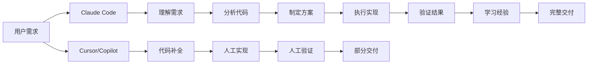

# Claude Code vs 竞品：为什么它是Top 1 Agent框架

## 引言：重新定义Agent框架的竞争维度

在AI编程助手领域，竞争异常激烈。但如果只看表面功能，很容易陷入"功能对比"的陷阱。真正的竞争不是"谁的功能更多"，而是**"谁的架构更能适应未来"**。

> **核心观点**：Claude Code不是在做"更好的IDE插件"，而是在构建**Agent时代的操作系统**。这是维度上的碾压。

## 第一部分：竞品全景分析

### 主要玩家

```yaml
竞品分类:
  IDE增强型:
    - Cursor: AI-first IDE
    - Continue: 开源AI助手
    - Cody: Sourcegraph的AI助手
    - Tabnine: 代码补全工具
    
  代码补全型:
    - GitHub Copilot: 代码补全
    - Amazon CodeWhisperer: 代码补全
    - Codeium: 代码补全
    - Tabnine: 代码补全
    
  Agent框架型:
    - LangChain Agents: 通用Agent框架
    - AutoGPT: 自主Agent
    - BabyAGI: 任务分解Agent
    - CrewAI: 多Agent协作
    
  专业工具型:
    - Claude Code: Agent操作系统
    - Devin: AI软件工程师
    - SWE-Agent: 软件工程Agent
    - OpenDevin: 开源Devin
```

### 竞品定位图谱

```
                    高自主性
                        │
                        │
    Devin ●             │         ● Claude Code
                        │
                        │
    AutoGPT ●           │           ● SWE-Agent
                        │
    ─────────────────────┼─────────────────────
    低专业性             │              高专业性
                        │
    LangChain ●         │         ● Cursor
                        │
                        │
    Copilot ●           │           ● Continue
                        │
                    低自主性
```

## 第二部分：深度对比分析

### 维度1：架构范式

#### Claude Code：Agent操作系统

```python
# Claude Code的架构范式
class ClaudeCodeArchitecture:
    """
    Agent操作系统范式
    """
    def __init__(self):
        # 核心层
        self.kernel = AgentKernel()
        
        # 系统服务
        self.memory = PersistentMemory()
        self.skills = SkillManager()
        self.hooks = HookSystem()
        self.tools = ToolRegistry()
        
        # 应用层
        self.agents = AgentManager()
        
    def process_request(self, request):
        """
        完整的Agent处理流程
        """
        # 1. 感知：理解请求和环境
        perception = self.perceive(request)
        
        # 2. 推理：规划和决策
        plan = self.reason(perception)
        
        # 3. 执行：调用工具执行
        result = self.execute(plan)
        
        # 4. 学习：更新记忆和技能
        self.learn(result)
        
        return result
```

#### Cursor/Copilot：IDE增强范式

```python
# Cursor/Copilot的架构范式
class IDEReactEnhancement:
    """
    IDE增强范式
    """
    def __init__(self):
        # 基于IDE的插件架构
        self.ide = IDEInterface()
        self.llm = LLMClient()
        
    def provide_suggestion(self, context):
        """
        提供代码建议
        """
        # 1. 获取上下文
        code_context = self.ide.get_code_context()
        
        # 2. 调用LLM
        suggestion = self.llm.generate(code_context)
        
        # 3. 返回建议
        return suggestion
        
    # 问题：没有记忆，没有工具，没有技能，没有钩子
    # 只能提供文本建议，不能执行操作
```

#### LangChain Agents：通用框架范式

```python
# LangChain Agents的架构范式
class LangChainAgent:
    """
    通用Agent框架范式
    """
    def __init__(self):
        # 通用框架抽象
        self.llm = LLM()
        self.tools = load_tools(["search", "calculator"])
        self.memory = ConversationBufferMemory()
        
    def run(self, query):
        """
        运行Agent
        """
        # 1. 使用通用提示词
        prompt = self.create_prompt(query)
        
        # 2. 调用LLM
        response = self.llm.call(prompt)
        
        # 3. 解析工具调用
        tool_calls = self.parse_tool_calls(response)
        
        # 4. 执行工具
        results = self.execute_tools(tool_calls)
        
        return results
        
    # 问题：需要大量定制，缺乏领域专业知识
```

### 维度2：能力对比

| 能力维度 | Claude Code | Cursor | Copilot | LangChain |
|---------|-------------|--------|---------|-----------|
| **记忆系统** | 三层记忆（会话/项目/长期） | 无 | 无 | 简单对话记忆 |
| **技能系统** | 可定义、可复用、可学习 | 无 | 无 | 需手动实现 |
| **工具集成** | 内置丰富工具 | 无 | 无 | 需手动集成 |
| **钩子机制** | 完整生命周期钩子 | 无 | 无 | 需手动实现 |
| **学习能力** | 持续学习优化 | 无 | 无 | 无 |
| **扩展性** | 三层扩展机制 | 插件 | 插件 | 代码级 |
| **领域专业** | 深度优化编程 | 通用 | 通用 | 通用 |
| **自主性** | 高（可自主完成任务） | 低（需人工指导） | 低（需人工指导） | 中（需大量配置） |

### 维度3：架构优势分析

#### Claude Code的架构优势

```python
# 优势1：端到端解决问题
class ClaudeCodeEndToEnd:
    def solve_problem(self, problem):
        """
        端到端解决问题
        """
        # 1. 理解问题
        understanding = self.understand(problem)
        
        # 2. 分析代码库
        analysis = self.analyze_codebase()
        
        # 3. 制定方案
        plan = self.create_plan(understanding, analysis)
        
        # 4. 执行方案（可调用任意工具）
        result = self.execute_plan(plan)
        
        # 5. 验证结果
        verification = self.verify(result)
        
        # 6. 学习经验
        self.learn(problem, result, verification)
        
        return result

# 优势2：持续学习优化
class ClaudeCodeLearning:
    def learn_from_experience(self, experience):
        """
        从经验中学习
        """
        # 1. 提取关键信息
        key_insights = extract_insights(experience)
        
        # 2. 更新记忆
        self.memory.store(key_insights)
        
        # 3. 优化技能
        self.skills.optimize(key_insights)
        
        # 4. 调整策略
        self.adjust_strategy(key_insights)

# 优势3：无限扩展能力
class ClaudeCodeExtensibility:
    def extend(self, extension_type, extension_config):
        """
        无限扩展
        """
        if extension_type == "tool":
            # 添加新工具
            self.tools.register(extension_config)
        elif extension_type == "skill":
            # 添加新技能
            self.skills.create(extension_config)
        elif extension_type == "hook":
            # 添加新钩子
            self.hooks.register(extension_config)
```

#### 竞品的架构局限

```python
# Cursor/Copilot的局限
class CursorLimitations:
    """
    Cursor/Copilot的根本局限
    """
    def __init__(self):
        # 局限1：无状态
        self.no_memory = True
        
        # 局限2：无工具
        self.no_tools = True
        
        # 局限3：无技能
        self.no_skills = True
        
        # 局限4：无钩子
        self.no_hooks = True
        
        # 局限5：IDE依赖
        self.ide_dependent = True
    
    # 结果：只能做代码补全，不能做复杂任务

# LangChain的局限
class LangChainLimitations:
    """
    LangChain的根本局限
    """
    def __init__(self):
        # 局限1：通用框架
        self.generic_framework = True
        
        # 局限2：缺乏领域知识
        self.no_domain_expertise = True
        
        # 局限3：集成成本高
        self.high_integration_cost = True
        
        # 局限4：性能开销
        self.performance_overhead = True
    
    # 结果：需要大量定制才能用于编程
```

## 第三部分：核心竞争力深度分析

### 竞争力1：Agent原生架构

```python
# Claude Code是Agent原生设计
class AgentNativeDesign:
    """
    从架构设计就为Agent优化
    """
    # 设计原则
    principles = {
        "autonomy": "Agent可以自主完成任务",
        "memory": "Agent可以记忆和学习",
        "tools": "Agent可以调用工具",
        "skills": "Agent可以掌握技能",
        "hooks": "Agent可以扩展能力"
    }
    
    # 与竞品的对比
    comparison = {
        "Cursor": "IDE增强，不是Agent",
        "Copilot": "代码补全，不是Agent",
        "LangChain": "通用Agent，不是专业Agent",
        "Claude Code": "专业Agent，原生设计"
    }
```

### 竞争力2：端到端解决方案



### 竞争力3：持续学习进化

```python
# Claude Code的持续学习
class ContinuousLearning:
    """
    Claude Code越用越聪明
    """
    def learning_cycle(self):
        """
        学习循环
        """
        while True:
            # 1. 执行任务
            result = self.execute_task()
            
            # 2. 反思结果
            reflection = self.reflect(result)
            
            # 3. 提取经验
            experience = self.extract_experience(reflection)
            
            # 4. 更新记忆
            self.memory.update(experience)
            
            # 5. 优化技能
            self.skills.optimize(experience)
            
            # 6. 调整策略
            self.adjust_strategy(experience)

# 竞品的静态能力
class StaticCapability:
    """
    竞品的能力是静态的
    """
    def __init__(self):
        # Cursor：每次使用都是相同的
        self.capability = "code_completion"
        
        # Copilot：不会学习用户偏好
        self.learning = False
        
        # LangChain：需要手动更新
        self.manual_update = True
```

### 竞争力4：企业级特性

```yaml
企业级特性对比:
  安全性:
    Claude Code:
      - 工具调用权限控制
      - 敏感信息检测
      - 安全扫描集成
      - 审计日志
    竞品:
      - 基本权限控制
      - 缺乏深度安全集成
      
  可观测性:
    Claude Code:
      - 完整执行日志
      - 性能监控
      - 错误追踪
      - 使用统计
    竞品:
      - 基本日志
      - 缺乏深度监控
      
  可扩展性:
    Claude Code:
      - 三层扩展机制
      - 自定义工具
      - 自定义技能
      - 自定义钩子
    竞品:
      - 插件扩展
      - 有限定制
      
  团队协作:
    Claude Code:
      - 共享技能库
      - 团队记忆库
      - 知识传承
      - 最佳实践共享
    竞品:
      - 个人使用
      - 缺乏团队特性
```

## 第四部分：为什么其他方案做不到

### 为什么Cursor/Copilot做不成Agent

```python
# Cursor/Copilot的架构限制
class WhyNotAgent:
    """
    为什么Cursor/Copilot做不成Agent
    """
    reasons = {
        # 1. 商业模式限制
        "business_model": {
            "issue": "订阅制，没有动力做深度集成",
            "result": "保持轻量，快速迭代"
        },
        
        # 2. 架构限制
        "architecture": {
            "issue": "基于IDE插件架构，能力受限",
            "result": "只能做代码补全，不能执行操作"
        },
        
        # 3. 技术限制
        "technical": {
            "issue": "无状态设计，无法记忆和学习",
            "result": "每次使用都是全新的"
        },
        
        # 4. 定位限制
        "positioning": {
            "issue": "定位为'更好的IDE'，不是Agent",
            "result": "功能边界明确，不做扩展"
        }
    }
```

### 为什么LangChain做不成专业Agent

```python
# LangChain的框架限制
class WhyNotProfessional:
    """
    为什么LangChain做不成专业Agent
    """
    reasons = {
        # 1. 通用框架问题
        "generic_framework": {
            "issue": "为通用场景设计，不针对编程",
            "result": "需要大量定制才能用于编程"
        },
        
        # 2. 集成成本问题
        "integration_cost": {
            "issue": "需要手动集成各种工具和服务",
            "result": "开发成本高，维护困难"
        },
        
        # 3. 性能问题
        "performance": {
            "issue": "通用抽象层带来性能开销",
            "result": "响应慢，资源消耗大"
        },
        
        # 4. 领域知识问题
        "domain_knowledge": {
            "issue": "缺乏编程领域的专业知识",
            "result": "无法提供专业的编程建议"
        }
    }
```

### 为什么Devin做不成主流

```python
# Devin的定位限制
class WhyNotMainstream:
    """
    为什么Devin做不成主流
    """
    reasons = {
        # 1. 定位过高
        "positioning": {
            "issue": "定位为'AI软件工程师'，期望过高",
            "result": "实际能力与宣传有差距"
        },
        
        # 2. 成本问题
        "cost": {
            "issue": "需要大量计算资源",
            "result": "使用成本高，难以普及"
        },
        
        # 3. 可控性问题
        "controllability": {
            "issue": "过于自主，用户难以控制",
            "result": "用户信任度低"
        },
        
        # 4. 集成问题
        "integration": {
            "issue": "独立系统，难以集成现有工作流",
            "result": "需要改变工作习惯"
        }
    }
```

## 第五部分：Claude Code的护城河

### 护城河1：架构优势

```python
# Claude Code的架构护城河
class ArchitectureMoat:
    """
    架构优势：其他竞品难以复制
    """
    advantages = {
        # 1. 三层架构
        "three_layer_architecture": {
            "perception": "深度理解代码和环境",
            "reasoning": "智能规划和决策",
            "execution": "丰富工具和技能"
        },
        
        # 2. 记忆系统
        "memory_system": {
            "session_memory": "会话上下文",
            "project_memory": "项目知识",
            "long_term_memory": "长期经验"
        },
        
        # 3. 技能系统
        "skill_system": {
            "discovery": "动态发现技能",
            "execution": "智能执行技能",
            "learning": "持续优化技能"
        },
        
        # 4. 钩子系统
        "hook_system": {
            "lifecycle": "完整生命周期",
            "extensibility": "无限扩展能力",
            "composition": "灵活组合能力"
        }
    }
    
    # 为什么难以复制
    why_hard_to_copy = {
        "time": "需要多年架构积累",
        "expertise": "需要深度领域知识",
        "iteration": "需要大量用户反馈",
        "integration": "需要深度系统集成"
    }
```

### 护城河2：数据优势

```python
# Claude Code的数据护城河
class DataMoat:
    """
    数据优势：越用越强
    """
    advantages = {
        # 1. 用户数据
        "user_data": {
            "preferences": "用户偏好和习惯",
            "patterns": "代码模式和风格",
            "feedback": "使用反馈和评价"
        },
        
        # 2. 项目数据
        "project_data": {
            "structures": "项目结构模式",
            "dependencies": "依赖关系图谱",
            "conventions": "项目约定规范"
        },
        
        # 3. 知识数据
        "knowledge_data": {
            "solutions": "问题解决方案",
            "patterns": "最佳实践模式",
            "pitfalls": "常见陷阱教训"
        }
    }
    
    # 飞轮效应
    flywheel_effect = """
    更多用户 → 更多数据 → 更好模型 → 更好体验 → 更多用户
    """
```

### 护城河3：生态优势

```python
# Claude Code的生态护城河
class EcosystemMoat:
    """
    生态优势：网络效应
    """
    advantages = {
        # 1. 技能生态
        "skill_ecosystem": {
            "builtin": "丰富的内置技能",
            "community": "活跃的社区技能",
            "enterprise": "专业的企业技能"
        },
        
        # 2. 工具生态
        "tool_ecosystem": {
            "builtin": "内置工具丰富",
            "integrations": "第三方集成广泛",
            "custom": "自定义工具灵活"
        },
        
        # 3. 知识生态
        "knowledge_ecosystem": {
            "documentation": "完善的文档",
            "tutorials": "丰富的教程",
            "community": "活跃的社区"
        }
    }
    
    # 网络效应
    network_effect = """
    更多技能 → 更多用户 → 更多开发者 → 更多技能
    """
```

## 第六部分：未来展望

### 技术趋势

```yaml
技术趋势:
  Agent化:
    - 从工具到Agent是必然趋势
    - Claude Code已经站在正确方向
    
  专业化:
    - 通用Agent将分化为专业Agent
    - Claude Code专注编程领域
    
  生态化:
    - 生态竞争将取代功能竞争
    - Claude Code的生态布局领先
    
  学习化:
    - 持续学习将成为标配
    - Claude Code的记忆和技能系统领先
```

### 竞争格局预测

```python
# 未来竞争格局
class FutureCompetition:
    """
    未来竞争格局预测
    """
    predictions = {
        # 1. IDE增强型将边缘化
        "ide_enhancement": {
            "players": ["Cursor", "Copilot", "Continue"],
            "trend": "逐渐边缘化，成为基础功能",
            "reason": "功能同质化，无法建立护城河"
        },
        
        # 2. 通用Agent框架将分化
        "generic_agent": {
            "players": ["LangChain", "AutoGPT", "BabyAGI"],
            "trend": "分化为垂直领域Agent",
            "reason": "通用框架无法满足专业需求"
        },
        
        # 3. 专业Agent将崛起
        "professional_agent": {
            "players": ["Claude Code", "Devin", "SWE-Agent"],
            "trend": "成为主流，各占细分领域",
            "reason": "专业能力是核心竞争力"
        },
        
        # 4. Claude Code的定位
        "claude_code": {
            "position": "编程Agent的领导者",
            "advantage": "架构、数据、生态三重护城河",
            "outlook": "有望成为编程Agent的标准"
        }
    }
```

## 结论：维度碾压

Claude Code之所以是Top 1 Agent框架，不是因为某个功能更强，而是因为**架构维度更高**：

1. **范式维度**：从"工具"到"Agent"的维度提升
2. **架构维度**：从"IDE插件"到"Agent操作系统"的维度提升
3. **能力维度**：从"代码补全"到"端到端解决问题"的维度提升
4. **进化维度**：从"静态能力"到"持续学习"的维度提升

**核心启示**：

> 在技术竞争中，**架构选择比功能实现更重要**。Claude Code选择了正确的架构方向，这决定了它的天花板远高于竞品。

**最终判断**：

- **Cursor/Copilot**：会成为IDE的标准功能，但不会成为Agent
- **LangChain**：会成为Agent开发框架，但不会成为专业Agent
- **Devin**：会成为AI工程师的探索，但不会成为主流工具
- **Claude Code**：会成为编程Agent的标准，引领Agent时代

---

**系列总结**：

通过四篇文章的深度分析，我们揭示了Claude Code成功的根本原因：

1. [架构设计哲学]()：Agent操作系统范式
2. [Hooks系统]()：可扩展的生命周期
3. [Skills与Memory]()：长期记忆与技能进化
4. [竞品分析]()：维度碾压的竞争力

Claude Code不是在做"更好的代码补全"，而是在构建"Agent时代的操作系统"。这是根本性的架构优势，决定了它将成为编程Agent的领导者。

---

**参考资料**：
- Anthropic官方技术博客
- Claude Code GitHub仓库
- Agent架构设计论文
- 竞品技术分析报告
- 开发者社区讨论
